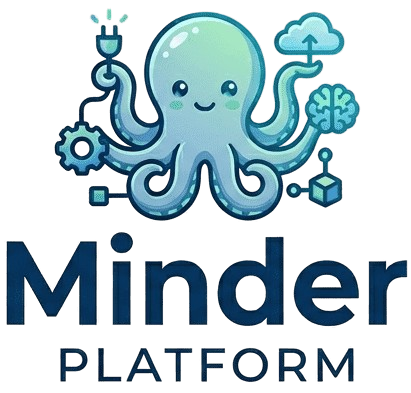

# 🚀 Minder Platform

<div align="center">



## Local AI Orchestration Platform

Your complete private AI infrastructure in a single command

[](https://opensource.org/licenses/MIT)
[](https://www.python.org/downloads/)
[](https://www.docker.com/)
[](https://github.com/wish-maker/minder)

Run LLMs, RAG pipelines, and AI automation completely locally - No API keys needed

[Quick Start](#-30-second-setup) • [Features](#-why-minder) • [Documentation](#-documentation) • [Contributing](#-contributing)

⭐ Star us on GitHub — it helps!

</div>

---

## 🌟 **Why Minder?**

Minder is a **self-hosted local AI platform**: 8 FastAPI microservices (RAG, knowledge graph,
plugins, model management, TTS/STT) behind a JWT-gated API gateway, plus OpenWebUI as the chat
frontend — all provisioned by one command, no cloud API keys required.

- 🔒 **Privacy**: nothing leaves your machine — everything runs on your own hardware
- 💰 **No per-call cost**: local inference via Ollama, not a metered API
- 🔧 **Extensible**: a manifest-based plugin system (no arbitrary code execution)
- 📊 **Observable**: Prometheus/Grafana/Jaeger built in, not bolted on

This is a **development environment** targeting a Raspberry Pi 4 (ARM) as its reference host —
see [Current Status](docs/architecture/overview.md#current-status) for exactly what's
production-hardened today and what isn't.

---

## ⚡ **30-Second Setup**

### 📋 **Prerequisites**
- Docker & Docker Compose
- Python 3.11+ (the `setup.sh` CLI is native Python; `setup.sh` is a thin shim, no bash needed)
- 4GB+ RAM recommended, 64GB+ free storage

### 🚀 **3 Simple Steps**

```bash
# 1️⃣ Clone the repository
git clone git@github.com:wish-maker/minder.git
cd minder

# 2️⃣ Run the setup script (fills any missing secrets in ./.env, then starts the stack)
bash setup.sh start

# 3️⃣ Access the chat UI (OpenWebUI, via Traefik — no real DNS by default,
#    so add this host entry first):
echo "127.0.0.1 chat.minder.local" | sudo tee -a /etc/hosts
# Open: https://chat.minder.local  (self-signed cert — your browser will warn once)
```

The API Gateway (`http://localhost:8000`) is for developers/integrations, not the chat UI — see
the printed banner for the full URL list + a JWT auth quickstart, and
[docs/guides/authentication.md](docs/guides/authentication.md) for the default Authelia login (a
shared default password baked into every clone — rotate it before exposing this instance to any
network).

### 🔐 **Environment Configuration**

**`./.env` is the one file you edit.** `setup.sh` mirrors it to `docker/.env` (auto-generated,
Compose's actual input) on every install/start/restart — don't edit that copy directly.

```bash
cp .env.example .env   # leave CHANGEME values for setup.sh to auto-fill, or set your own
bash setup.sh start    # auto-fills remaining secrets, sets perms (600), starts
```

Auto-generated on first run: database passwords (PostgreSQL/Redis/RabbitMQ), JWT secrets,
Authelia SSO encryption keys, and service credentials (Neo4j/InfluxDB/MinIO/Grafana). See
[.env.example](.env.example) for every available option, and
[docs/guides/security-setup.md](docs/guides/security-setup.md) for hardening guidance before
exposing an instance beyond your LAN.

---

## 🎯 **Real-World Usage Scenarios**

### 📚 **"I want to chat with my documents privately"**
```bash
# Create a knowledge base (name required; description optional), then upload documents
curl -X POST http://localhost:8004/knowledge-bases \
  -H "Content-Type: application/json" -d '{"name":"My Docs","description":"my documents"}'
curl -X POST http://localhost:8004/knowledge-bases/<kb_id>/upload -F "file=@report.pdf"

# Then create a pipeline over the KB and query it
curl -X POST http://localhost:8004/pipeline \
  -H "Content-Type: application/json" -d '{"name":"my-pipe","knowledge_base_ids":["<kb_id>"]}'
curl -X POST http://localhost:8004/pipeline/<pipeline_id>/query \
  -H "Content-Type: application/json" -d '{"question":"What is in my docs?","top_k":3}'
# Generation needs a reachable Ollama (OLLAMA_BASE_URL) — see docs/getting-started/ai-setup.md.
```

### 🤖 **"I want to run custom AI models locally"**
Open the [Minder Client](http://localhost:8009/model-management) — list installed models,
pull a new one, delete one, or test-prompt one directly, all from the browser.

```bash
# Or manage models from inside the container directly (Ollama is internal-only,
# :11434 is NOT host-exposed):
docker exec minder-ollama ollama list
docker exec -it minder-ollama ollama run mistral
# Or chat through OpenWebUI (served via Traefik).
```

### 📊 **"I need to monitor my AI system"**
- Grafana: `http://localhost:3000` (user `admin`; password = `GRAFANA_PASSWORD` in `.env`)
- Prometheus: `http://localhost:9090` · Jaeger: `http://localhost:16686`

---

## 🏗️ **Architecture at a Glance**

8 core FastAPI services (api-gateway, plugin-registry, marketplace, plugin-state-manager,
rag-pipeline, model-management, tts-stt, graph-rag) behind Traefik, backed by
PostgreSQL/Redis/Qdrant/Neo4j/RabbitMQ/MinIO/InfluxDB, with Ollama for local inference and
OpenWebUI as the chat frontend — plus a full Prometheus/Grafana/Jaeger observability stack.
`bash setup.sh install` seeds the **standard** bundle (core + inference + rag + chat); monitoring,
graph-rag, and voice are opt-in (`setup.sh bundle enable <name>`, or `install --profile full` for
all services).

**→ Full breakdown, ports, diagrams, data flow:** [docs/architecture/overview.md](docs/architecture/overview.md)
**→ Feature-by-feature detail** (RAG methods, plugin system, security posture, observability):
[docs/architecture/microservices.md](docs/architecture/microservices.md) ·
[docs/architecture/plugins.md](docs/architecture/plugins.md) ·
[docs/operations/security-architecture.md](docs/operations/security-architecture.md)

---

## 📈 **Performance, Operations & Troubleshooting**

Minder targets a Raspberry Pi 4 (ARM) as its reference host — no synthetic benchmark numbers are
published; measure your own with the built-in Prometheus/Grafana/Jaeger stack. Common commands:

```bash
bash setup.sh doctor              # full system health check + diagnostics
bash setup.sh status              # service status dashboard
bash setup.sh backup              # create a full backup
bash setup.sh restart rag-pipeline  # restart one service (or the whole stack with no argument)
```

**→ Tuning levers, resource sizing:** [docs/guides/performance.md](docs/guides/performance.md)
**→ Diagnosing a stuck/unhealthy stack:** [docs/troubleshooting/common-issues.md](docs/troubleshooting/common-issues.md)

---

## 📖 **Documentation**

- **[📚 Documentation Index](./docs/README.md)** — full navigation
- **[🏗️ Architecture Guide](./docs/architecture/overview.md)** — system design and patterns
- **[🔌 API Documentation](./docs/guides/api.md)** — API reference (interactive docs also at `/docs` on api-gateway/rag-pipeline/plugin-registry)
- **[📝 Development Guidelines](./docs/development/development.md)** — coding standards, plugin development, testing
- **[🗺️ Roadmap](./docs/architecture/roadmap.md)** — where the platform is headed (GitHub issues are the live backlog)

---

## 🏗️ **Project Structure**

```
minder/
├── docker/               # Docker configuration (docker-compose.yml is the hand-maintained source of truth)
├── src/                  # Source code: services/, shared/, plugins/, bootstrap/, requirements/
├── scripts/              # setup/ (native-Python setup CLI), lib/ + gate/ (bash-parity reference)
├── docs/                 # Documentation (see docs/README.md)
├── tests/                # unit/, integration/, e2e/
├── README.md, CONTRIBUTING.md, LICENSE
└── setup.sh              # Entrypoint — thin shim → `python -m scripts.setup`
```

**→ Full layout with every subdirectory explained:** [docs/architecture/project-structure.md](docs/architecture/project-structure.md)

---

## 🤝 **Contributing**

We welcome contributions from developers of all skill levels — bug fixes, features, docs, tests,
and community plugins. See **[CONTRIBUTING.md](./CONTRIBUTING.md)** for the full workflow, code
style, and testing requirements.

---

## 📜 **License**

MIT — see [LICENSE](LICENSE).

## 🙏 **Acknowledgments**

Built with [Ollama](https://ollama.com), [Qdrant](https://qdrant.tech),
[FastAPI](https://fastapi.tiangolo.com), [Neo4j](https://neo4j.com), and the open-source community.

## 📞 **Contact & Community**

- **Issues**: [Report bugs / request features](https://github.com/wish-maker/minder/issues)
- **Discussions**: [Join conversations](https://github.com/wish-maker/minder/discussions)

---

<div align="center">

**⭐ Star us on GitHub — it helps!**

</div>
