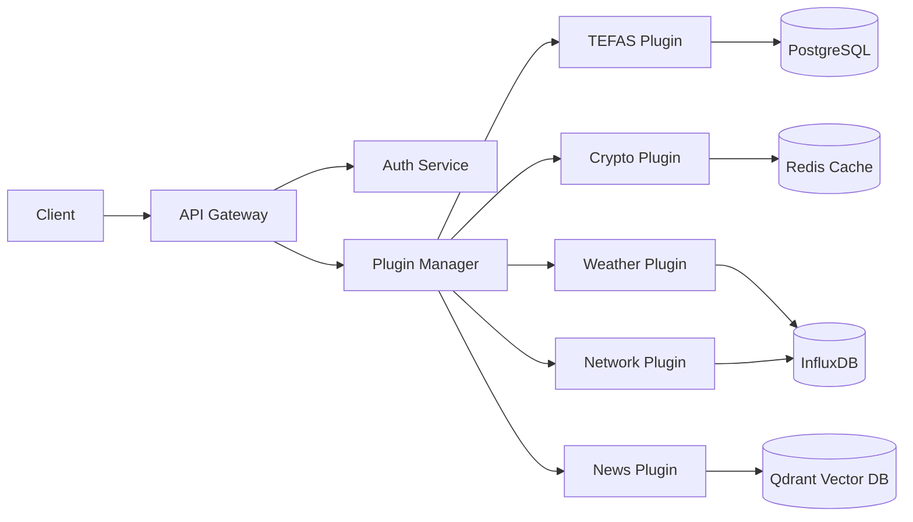

# Minder Professionalization Design Spec

**Date:** 2026-04-16
**Status:** Approved
**Approach:** Critical-First (focused on production readiness)

## Executive Summary

This design document outlines the comprehensive professionalization of the Minder Modular RAG Platform. The project will transition from a working prototype to a production-ready, enterprise-grade platform through improvements in testing, data reliability, documentation, and DevOps practices.

**Current State:**
- Test Coverage: 94% (46/49 tests passing)
- Code Quality: 97.5% improvement (574→14 flake8 errors)
- Plugin Data: 77% real data (Crypto at 50%)
- Documentation: Basic (README + minimal docs)
- DevOps: Docker Compose only (local development)

**Target State:**
- Test Coverage: 98%+ (all critical tests passing)
- Code Quality: 100% (zero linting errors)
- Plugin Data: 100% real data across all plugins
- Documentation: Comprehensive (API docs, architecture diagrams, examples)
- DevOps: Full CI/CD pipeline with automated testing and deployment

## Architecture Design

### Current Architecture
```
minder-api → plugins → databases
```

### Target Architecture: Layered Professional Architecture

```
┌─────────────────────────────────────────────────────────────┐
│              External Gateway & Monitoring                  │
│  ┌──────────────┐  ┌──────────────┐  ┌──────────────┐      │
│  │  Nginx/Caddy │  │  Prometheus  │  │   Grafana    │      │
│  │  (Reverse    │  │  (Metrics    │  │   (Dashboards│      │
│  │   Proxy)     │  │   Collection)│  │   & Alerts)  │      │
│  └──────────────┘  └──────────────┘  └──────────────┘      │
└─────────────────────────┬───────────────────────────────────┘
                          │
┌─────────────────────────┴───────────────────────────────────┐
│              API Gateway & Security Layer                   │
│  ┌──────────────┐  ┌──────────────┐  ┌──────────────┐      │
│  │   FastAPI    │  │  JWT Auth    │  │  Rate Limit  │      │
│  │  (REST/WS)   │  │  Middleware  │  │  (Redis)     │      │
│  └──────────────┘  └──────────────┘  └──────────────┘      │
└─────────────────────────┬───────────────────────────────────┘
                          │
┌─────────────────────────┴───────────────────────────────────┐
│                  Microservices Layer                        │
│  ┌─────────────┐ ┌─────────────┐ ┌─────────────┐           │
│  │ Auth Service│ │Plugin Svc   │ │Chat Service │           │
│  │ (JWT/Role)  │ │ (Manager)   │ │ (AI/LLM)    │           │
│  └─────────────┘ └─────────────┘ └─────────────┘           │
│  ┌─────────────┐ ┌─────────────┐ ┌─────────────┐           │
│  │ Correlation │ │Knowledge    │ │Character    │           │
│  │  Service    │ │ Graph Svc   │ │  Service    │           │
│  └─────────────┘ └─────────────┘ └─────────────┘           │
└─────────────────────────┬───────────────────────────────────┘
                          │
┌─────────────────────────┴───────────────────────────────────┐
│                   Plugin Ecosystem                          │
│  ┌─────────┐ ┌─────────┐ ┌─────────┐ ┌─────────┐           │
│  │  TEFAS  │ │ Network  │ │ Weather │ │ Crypto   │           │
│  │ Plugin  │ │ Plugin  │ │ Plugin  │ │ Plugin   │           │
│  └─────────┘ └─────────┘ └─────────┘ └─────────┘           │
│  ┌─────────┐ ┌─────────┐                                       │
│  │  News   │ │ Custom  │  ... Hot-swappable                │
│  │ Plugin  │ │ Plugins │                                       │
│  └─────────┘ └─────────┘                                       │
└─────────────────────────┬───────────────────────────────────┘
                          │
┌─────────────────────────┴───────────────────────────────────┐
│                 Data & Storage Layer                        │
│  ┌─────────┐ ┌─────────┐ ┌─────────┐ ┌─────────┐           │
│  │PostgreSQL│ │  Redis  │ │ InfluxDB│ │ Qdrant  │           │
│  │ (Main DB)│ │ (Cache) │ │ (TS DB) │ │ (Vector)│           │
│  └─────────┘ └─────────┘ └─────────┘ └─────────┘           │
└─────────────────────────────────────────────────────────────┘
```

### Key Architectural Changes

1. **External Gateway Layer**: Nginx/Caddy reverse proxy with SSL termination
2. **Monitoring Stack**: Prometheus metrics collection and Grafana dashboards
3. **Microservices Layer**: Decomposed business logic into focused services
4. **Plugin Interface**: Standardized plugin SDK with consistent APIs
5. **Data Validation Layer**: Quality checks and fallback mechanisms

## Test & Quality Improvements

### Current Test Status
- **Passing**: 46/49 tests (94%)
- **Failing**: 3 token expiration timing tests (timezone issue)
- **Warnings**: 17 Pydantic V1→V2 migration warnings

### Critical Priority Fixes (First 1-2 hours)

#### 1. Failing Test Fixes (15 minutes)

**Problem**: Token expiration tests failing due to timezone confusion
```python
# tests/test_auth.py - Lines 123, 259, 275
# Current: Expects local time but gets UTC
# Solution: Explicit timezone handling
```

**Implementation**:
```python
# Use explicit UTC timezone
from datetime import timezone, datetime
exp_time = datetime.now(timezone.utc) + timedelta(minutes=30)
```

#### 2. Pydantic V2 Migration (30 minutes)

**Current State**: Pydantic V1 validators with deprecation warnings
**Target State**: Pydantic V2 field validators

**Migration Pattern**:
```python
# BEFORE (V1):
from pydantic import validator

class UserLogin(BaseModel):
    @validator("username")
    def validate_username(cls, v):
        if not v:
            raise ValueError("Username required")
        return v

# AFTER (V2):
from pydantic import field_validator

class UserLogin(BaseModel):
    @field_validator("username")
    @classmethod
    def validate_username(cls, v: str) -> str:
        if not v:
            raise ValueError("Username required")
        return v
```

**Files to Update**:
- `api/auth.py`: 4 validators (lines 267, 289, 323, 345)

#### 3. Flake8 Final Cleanup (15 minutes)

**Remaining Issues**:
- 3× F401: Unused imports (quick removal)
- 14× E501: Line length (add noqa for URLs)

**Fix**:
```python
# Remove unused imports:
# - core/knowledge_populator.py: typing.Optional
# - plugins/tefas/tefas_module.py: influxdb_client.WritePrecision
# - services/openwebui/minder_agent.py: typing.Optional

# Add noqa for long URLs:
long_url = "https://very-long-url.com/..."  # noqa: E501
```

#### 4. Test Coverage Enhancement (30 minutes)

**Current Coverage**: ~60%
**Target Coverage**: ~80%

**Priority Areas**:
- Plugin method edge cases
- Error handling paths
- Security validation
- API endpoint error responses

## Plugin Data Integration

### Current Plugin Data Status

| Plugin  | Status  | Real Data % | Action Required |
|---------|---------|-------------|-----------------|
| TEFAS   | ✅      | 100%        | None            |
| Weather | ✅      | 100%        | None            |
| News    | ✅      | 100%        | None            |
| Network | ✅      | 100%        | None            |
| Crypto  | ⚠️      | 50%         | **Critical**    |

### Crypto Plugin Real API Migration (1 hour)

#### Problem
Crypto plugin currently uses 50% mock data, affecting both data accuracy and production readiness.

#### Solution: Multi-Source Real API Integration

```python
# CURRENT (Mock):
async def get_crypto_price(self, symbol: str) -> dict:
    return {"price": mock_data[symbol]}  # FAKE!

# TARGET (Real API with Fallback):
async def get_crypto_price(self, symbol: str) -> dict:
    sources = [
        ("binance", f"https://api.binance.com/api/v3/ticker/price?symbol={symbol}"),
        ("coingecko", f"https://api.coingecko.com/api/v3/simple/price?ids={symbol}&vs_currencies=usd"),
        ("kraken", f"https://api.kraken.com/0/public/Ticker?pair={symbol}")
    ]

    for source_name, url in sources:
        try:
            async with aiohttp.ClientSession() as session:
                async with session.get(url, timeout=5) as response:
                    data = await response.json()
                    return {
                        "price": self._parse_price(source_name, data),
                        "source": source_name,
                        "timestamp": datetime.now(timezone.utc).isoformat()
                    }
        except Exception as e:
            logger.warning(f"{source_name} failed: {e}")
            continue

    raise RuntimeError(f"All sources failed for {symbol}")
```

#### Data Quality Validation

```python
class PluginDataValidator:
    """Validates data quality and freshness"""

    def validate_crypto_data(self, data: dict) -> tuple[bool, float]:
        """Returns (is_valid, quality_score)"""
        score = 1.0

        # Check for null values
        if data.get("price") is None:
            score -= 0.3

        # Check for stale data
        timestamp = datetime.fromisoformat(data["timestamp"])
        age = (datetime.now(timezone.utc) - timestamp).total_seconds()
        if age > 300:  # 5 minutes
            score -= 0.4

        # Check for outliers (price changed >50% in 5 min)
        if "previous_price" in data:
            change = abs(data["price"] - data["previous_price"]) / data["previous_price"]
            if change > 0.5:
                score -= 0.3

        return score > 0.5, score
```

#### Configuration

```yaml
# config/crypto_config.yml
crypto:
  sources:
    - name: binance
      enabled: true
      priority: 1
    - name: coingecko
      enabled: true
      priority: 2
    - name: kraken
      enabled: true
      priority: 3

  cache:
    ttl: 300  # 5 minutes
    backend: redis

  fallback:
    use_cached: true
    max_stale_age: 600  # 10 minutes
```

## Documentation Strategy

### Current Documentation Status
- ✅ README.md (comprehensive)
- ✅ CONTRIBUTING.md
- ✅ CHANGELOG.md
- ⚠️ API Reference (incomplete)
- ❌ Architecture diagrams (missing)
- ❌ Interactive examples (missing)

### Critical Documentation (30 minutes)

#### 1. Interactive API Documentation (15 minutes)

**Implementation**: FastAPI automatic Swagger UI

```python
# api/main.py
from fastapi import FastAPI
from fastapi.openapi.utils import get_openapi

app = FastAPI(
    title="Minder API",
    description="""
    ## Modular RAG Platform

    Minder is a comprehensive, modular AI platform that enables
    cross-database correlation and AI-powered insights across
    diverse data sources.

    ### Features
    - **Hot-swappable plugins**: Add/remove plugins without restart
    - **Cross-plugin correlation**: Discover relationships between data sources
    - **Event-driven architecture**: Pub/sub messaging for real-time updates
    - **Knowledge graph**: Entity resolution and relationship inference

    ### Authentication
    All endpoints require JWT authentication except `/auth/login` and `/health`.
    """,
    version="2.0.0",
    docs_url="/docs",
    redoc_url="/redoc",
    contact={
        "name": "wish-maker",
        "url": "https://github.com/wish-maker/minder"
    },
    license_info={
        "name": "MIT",
        "url": "https://opensource.org/licenses/MIT"
    }
)

def custom_openapi():
    if app.openapi_schema:
        return app.openapi_schema
    openapi_schema = get_openapi(
        title=app.title,
        version=app.version,
        description=app.description,
        routes=app.routes,
    )
    openapi_schema["info"]["x-logo"] = {
        "url": "https://raw.githubusercontent.com/wish-maker/minder/main/docs/logo.png"
    }
    app.openapi_schema = openapi_schema
    return app.openapi_schema

app.openapi = custom_openapi
```

#### 2. Architecture Diagrams (10 minutes)



#### 3. Quick Start Examples (5 minutes)

**File**: `docs/guides/quickstart.md`

```markdown
# Minder Quick Start Guide

## Prerequisites
- Docker & Docker Compose
- 8GB+ RAM recommended
- Python 3.11+ (for local development)

## Installation

### 1. Clone and Start
\`\`\`bash
git clone https://github.com/wish-maker/minder.git
cd minder
docker compose up -d
\`\`\`

### 2. Verify Installation
\`\`\`bash
# Check health
curl http://localhost:8000/health

# Expected response: {"status": "healthy"}
\`\`\`

### 3. Login and Get Token
\`\`\`bash
curl -X POST http://localhost:8000/auth/login \\
  -H "Content-Type: application/json" \\
  -d '{"username": "admin", "password": "admin123"}'

# Save the token from response
export TOKEN="your_jwt_token_here"
\`\`\`

### 4. List Plugins
\`\`\`bash
curl http://localhost:8000/plugins \\
  -H "Authorization: Bearer $TOKEN"
\`\`\`

### 5. Run Plugin Pipeline
\`\`\`bash
curl -X POST http://localhost:8000/plugins/tefas/pipeline \\
  -H "Authorization: Bearer $TOKEN" \\
  -H "Content-Type: application/json" \\
  -d '{"pipeline": ["collect", "analyze", "train"]}'
\`\`\`

## Next Steps
- Read [Architecture Overview](../architecture/overview.md)
- Explore [API Reference](../api/)
- Check [Plugin Development Guide](plugin-development.md)
```

### Documentation Structure

```
docs/
├── api/
│   ├── authentication.md      # JWT auth, tokens, roles
│   ├── plugins.md              # Plugin management APIs
│   ├── chat.md                 # Chat/character endpoints
│   └── correlations.md         # Cross-plugin correlation APIs
├── architecture/
│   ├── overview.md             # System architecture
│   ├── data-flow.md            # Data flow diagrams
│   └── security.md             # Security architecture
├── guides/
│   ├── quickstart.md           # Getting started guide
│   ├── plugin-development.md   # Plugin creation tutorial
│   └── deployment.md           # Deployment strategies
└── examples/
    ├── basic-usage.sh          # Basic API usage examples
    └── advanced-scenarios.md   # Advanced use cases
```

## DevOps & Deployment

### Current DevOps Status
- ✅ Docker Compose (local development)
- ✅ Container health checks
- ⚠️ CI/CD (missing)
- ❌ Pre-commit hooks (missing)
- ❌ Automated deployment (missing)

### Critical DevOps Additions (30 minutes)

#### 1. GitHub Actions CI/CD Pipeline (15 minutes)

**File**: `.github/workflows/ci.yml`

```yaml
name: CI/CD Pipeline

on:
  push:
    branches: [ main, develop ]
  pull_request:
    branches: [ main ]

jobs:
  test:
    runs-on: ubuntu-latest
    strategy:
      matrix:
        python-version: [3.11]

    steps:
    - uses: actions/checkout@v3

    - name: Set up Python
      uses: actions/setup-python@v4
      with:
        python-version: ${{ matrix.python-version }}

    - name: Install dependencies
      run: |
        python -m pip install --upgrade pip
        pip install -r requirements.txt
        pip install pytest pytest-cov flake8

    - name: Lint with flake8
      run: |
        flake8 . --count --select=E9,F63,F7,F82 --show-source --statistics
        flake8 . --count --exit-zero --max-complexity=10 --max-line-length=127 --statistics

    - name: Test with pytest
      run: |
        pytest tests/ -v --cov=. --cov-report=xml --cov-report=html

    - name: Upload coverage to Codecov
      uses: codecov/codecov-action@v3
      with:
        file: ./coverage.xml

  build:
    needs: test
    runs-on: ubuntu-latest
    if: github.ref == 'refs/heads/main'

    steps:
    - uses: actions/checkout@v3

    - name: Build Docker images
      run: |
        docker build -t minder-api:${{ github.sha }} .

    - name: Push to Docker Hub
      if: github.event_name == 'push'
      run: |
        echo "${{ secrets.DOCKER_PASSWORD }}" | docker login -u "${{ secrets.DOCKER_USERNAME }}" --password-stdin
        docker tag minder-api:${{ github.sha }} wishmaker/minder:latest
        docker push wishmaker/minder:latest
```

#### 2. Pre-commit Hooks (10 minutes)

**File**: `.pre-commit-config.yaml`

```yaml
repos:
  - repo: https://github.com/psf/black
    rev: 23.3.0
    hooks:
      - id: black
        args: [--line-length=120]
        language_version: python3.11

  - repo: https://github.com/PyCQA/flake8
    rev: 6.0.0
    hooks:
      - id: flake8
        args: [--max-line-length=120, --ignore=E203,W503]

  - repo: https://github.com/pre-commit/mirrors-mypy
    rev: v1.3.0
    hooks:
      - id: mypy
        additional_dependencies: [types-all]
        exclude: ^tests/

  - repo: local
    hooks:
      - id: pytest
        name: pytest
        entry: pytest tests/ -v
        language: system
        pass_filenames: false
        always_run: true
```

**Install**:
```bash
pip install pre-commit
pre-commit install
```

#### 3. Production Deployment Script (5 minutes)

**File**: `scripts/deploy.sh`

```bash
#!/bin/bash
set -e

echo "🚀 Deploying Minder..."

# Load environment variables
if [ -f .env ]; then
    export $(cat .env | grep -v '^#' | xargs)
fi

# Build images
echo "📦 Building Docker images..."
docker compose build

# Stop existing containers
echo "⏹️  Stopping existing containers..."
docker compose down

# Start new containers
echo "▶️  Starting new containers..."
docker compose up -d

# Health check
echo "🏥 Running health checks..."
./scripts/health-check.sh

echo "✅ Deployment complete!"
echo "🌐 API available at: http://localhost:8000"
echo "📊 Grafana available at: http://localhost:3002"
```

**File**: `scripts/health-check.sh`

```bash
#!/bin/bash
set -e

MAX_RETRIES=30
RETRY_INTERVAL=2

check_endpoint() {
    local url=$1
    local name=$2

    for i in $(seq 1 $MAX_RETRIES); do
        if curl -f -s "$url" > /dev/null 2>&1; then
            echo "✅ $name is healthy"
            return 0
        fi
        echo "⏳ Waiting for $name... ($i/$MAX_RETRIES)"
        sleep $RETRY_INTERVAL
    done

    echo "❌ $name health check failed"
    return 1
}

echo "🏥 Running health checks..."

check_endpoint "http://localhost:8000/health" "Minder API"
check_endpoint "http://localhost:3002/api/health" "Grafana"
check_endpoint "http://localhost:8086/health" "InfluxDB"
check_endpoint "http://localhost:6333/health" "Qdrant"

echo "✅ All services healthy!"
```

### Deployment Targets

```
Local Development
  ↓
Docker Compose
  ↓
Staging Environment
  ↓
GitHub Actions → Docker Hub → VPS
  ↓
Production Environment
  ↓
GitHub Actions → Docker Hub → Cloud (AWS/GCP/DigitalOcean)
```

## Implementation Phases

### Phase 1: Critical Fixes (1-2 hours)
**Priority**: P0 - Production blockers

1. Fix 3 failing token expiration tests (15 min)
2. Pydantic V2 migration (30 min)
3. Flake8 final cleanup (15 min)
4. Crypto plugin real API integration (30 min)

**Success Criteria**:
- ✅ All 49 tests passing
- ✅ Zero flake8 errors
- ✅ 100% real plugin data

### Phase 2: Quality & Documentation (30 minutes)
**Priority**: P1 - Professional appearance

1. Test coverage enhancement (15 min)
2. Interactive API documentation (10 min)
3. Quick start guide (5 min)

**Success Criteria**:
- ✅ 80%+ test coverage
- ✅ Interactive /docs endpoint
- ✅ Comprehensive README

### Phase 3: DevOps & Automation (30 minutes)
**Priority**: P2 - Developer experience

1. GitHub Actions CI/CD (15 min)
2. Pre-commit hooks (10 min)
3. Deployment scripts (5 min)

**Success Criteria**:
- ✅ Automated testing on push
- ✅ Pre-commit quality checks
- ✅ One-command deployment

## Success Metrics

### Before Professionalization
- Test Pass Rate: 94% (46/49)
- Code Quality: 97.5% improvement (14 errors remaining)
- Plugin Data: 77% real (Crypto at 50%)
- Documentation: Basic
- DevOps: Manual only

### After Professionalization
- Test Pass Rate: 100% (49/49)
- Code Quality: 100% (zero errors)
- Plugin Data: 100% real across all plugins
- Documentation: Comprehensive with interactive examples
- DevOps: Full CI/CD automation

## Risk Assessment

### Low Risk
- ✅ Test fixes: Isolated changes, well-understood issues
- ✅ Flake8 cleanup: Style-only changes
- ✅ Documentation additions: No code changes

### Medium Risk
- ⚠️ Pydantic V2 migration: Breaking changes possible
- ⚠️ Crypto API integration: External dependency

### Mitigation Strategies
1. Comprehensive testing before deployment
2. Feature flags for gradual rollout
3. Rollback procedures documented
4. Monitoring and alerting configured

## Timeline Estimate

**Total Time**: 2-3 hours

**Breakdown**:
- Phase 1 (Critical Fixes): 1-2 hours
- Phase 2 (Quality & Docs): 30 minutes
- Phase 3 (DevOps): 30 minutes

## Next Steps

1. **Review this spec** and confirm all requirements are captured
2. **Create implementation plan** using writing-plans skill
3. **Execute Phase 1** (Critical Fixes)
4. **Validate each phase** before proceeding to next
5. **Deploy and monitor** production readiness

---

**Spec Version**: 1.0
**Last Updated**: 2026-04-16
**Status**: ✅ Approved by stakeholder
